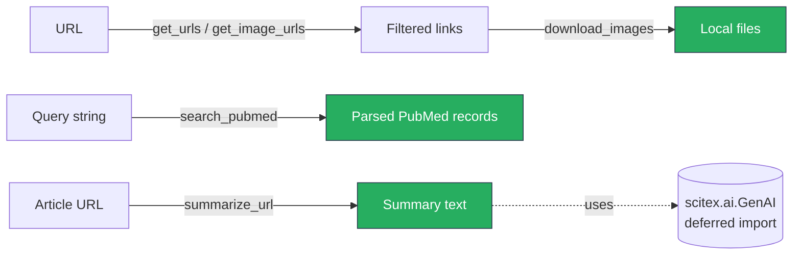
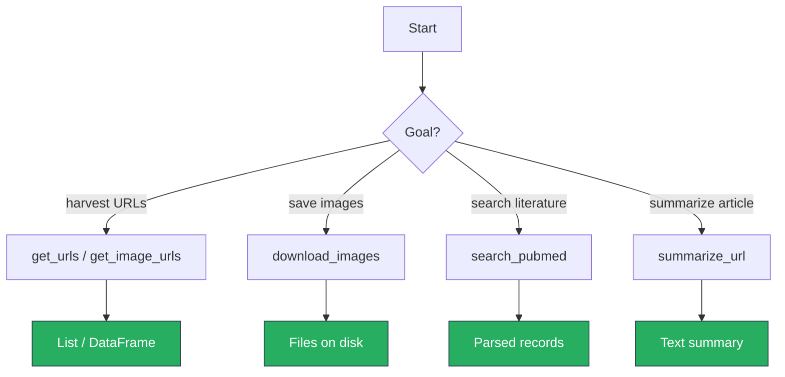

# scitex-web

<p align="center">
  <a href="https://scitex.ai">
    
  </a>
</p>

<p align="center"><b>Web scraping + PubMed search + URL summarization helpers.</b></p>

<p align="center">
  <a href="https://scitex-web.readthedocs.io/">Full Documentation</a> · <code>uv pip install scitex-web[all]</code>
</p>

<!-- scitex-badges:start -->
<p align="center">
  <a href="https://pypi.org/project/scitex-web/"></a>
  <a href="https://pypi.org/project/scitex-web/"></a>
  <a href="https://github.com/ywatanabe1989/scitex-web/actions/workflows/test.yml"></a>
  <a href="https://codecov.io/gh/ywatanabe1989/scitex-web"></a>
  <a href="https://scitex-web.readthedocs.io/en/latest/"></a>
  <a href="https://www.gnu.org/licenses/agpl-3.0"></a>
</p>
<!-- scitex-badges:end -->

---

## Problem and Solution

| # | Problem | Solution |
|---|---------|----------|
| 1 | **Bulk-fetching links / images means handwriting `requests`+`bs4` boilerplate** every project | **`get_urls`, `get_image_urls`, `download_images`** — pattern + min-size + same-domain filters in one call |
| 2 | **PubMed E-utilities require XML parsing, retries, and pagination** — easy to get wrong | **`search_pubmed(query, retmax=N)`** — returns parsed records; handles pagination + rate limits |
| 3 | **Skimming an article means opening a tab, grabbing the body, summarizing manually** | **`summarize_url(url)`** — readability extraction + LLM summary (via the SciTeX umbrella) |

## Architecture

```
scitex_web/
├── _scrape.py          # get_urls / get_image_urls / download_images
├── _pubmed.py          # search_pubmed (E-utilities client)
├── _summarize.py       # summarize_url (deferred GenAI import)
└── _utils.py           # shared logging + ANSI helpers
```



<p align="center"><sub><b>Figure 1.</b> Module layout. Three independent capabilities — scraping, PubMed search, URL summarization. Only summarization needs the umbrella <code>scitex</code> for the GenAI client.</sub></p>

## Installation

```bash
pip install scitex-web
pip install "scitex-web[readability]"   # readability-lxml for cleaner extraction
```

## Quick Start

```python
import scitex_web as web

results = web.search_pubmed("CRISPR Cas9 review", retmax=5)
images = web.get_image_urls("https://example.com/gallery", min_size=128)
```

## 1 Interfaces

<details open>
<summary><strong>Python API</strong></summary>

<br>

```python
import scitex_web as web

# Scraping
web.get_urls(url, pattern=r"\.pdf$")
web.get_image_urls(url, min_size=128)
web.download_images(url, out_dir="imgs", same_domain=True)

# PubMed
web.search_pubmed("CRISPR Cas9 review", retmax=50)

# URL summarization (requires scitex.ai umbrella)
web.summarize_url("https://example.com/article")
```

</details>

## Demo

```python
import scitex_web as web

# 1) Scrape PDFs from a faculty page
pdfs = web.get_urls("https://lab.example.edu/publications", pattern=r"\.pdf$")
#   → ['https://lab.example.edu/papers/2024_smith.pdf', ...]

# 2) Bulk-download figures (same domain, ≥256px)
web.download_images(
    "https://example.com/gallery",
    out_dir="imgs",
    same_domain=True,
    min_size=256,
)

# 3) Search PubMed
records = web.search_pubmed("CRISPR Cas9 review", retmax=5)
for r in records:
    print(r["pmid"], r["title"])

# 4) Summarize an article (requires umbrella scitex)
print(web.summarize_url("https://example.com/article"))
```



<p align="center"><sub><b>Figure 2.</b> Demo. Pick a helper by output shape: links, files, records, or summary text.</sub></p>

## Status

Standalone fork of `scitex.web`. Deps: requests / aiohttp / bs4 / tqdm. The
umbrella package's `scitex.web` import path is preserved via a
`sys.modules`-alias bridge.

Decoupling notes:
- `scitex.logging.getLogger` → stdlib `logging.getLogger`.
- `scitex.str.printc` (colored print) → tiny inline ANSI helper.
- `scitex.ai.GenAI` (used by `summarize_url`) → deferred import that raises
  a clear ImportError if the umbrella `scitex` package isn't installed.

## Part of SciTeX

`scitex-web` is part of [**SciTeX**](https://scitex.ai). Install via
the umbrella with `pip install scitex[web]` to use as
`scitex.web` (Python) or `scitex web ...` (CLI).

>Four Freedoms for Research
>
>0. The freedom to **run** your research anywhere — your machine, your terms.
>1. The freedom to **study** how every step works — from raw data to final manuscript.
>2. The freedom to **redistribute** your workflows, not just your papers.
>3. The freedom to **modify** any module and share improvements with the community.
>
>AGPL-3.0 — because we believe research infrastructure deserves the same freedoms as the software it runs on.

## License

AGPL-3.0-only (see [LICENSE](./LICENSE)).

---

<p align="center">
  <a href="https://scitex.ai" target="_blank"></a>
</p>
